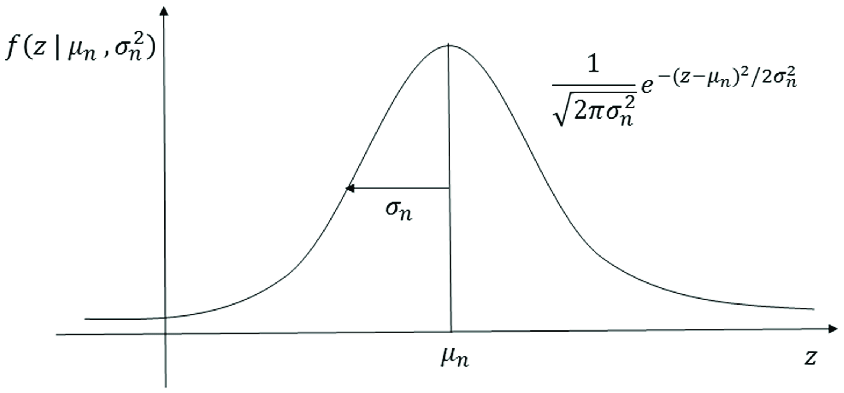
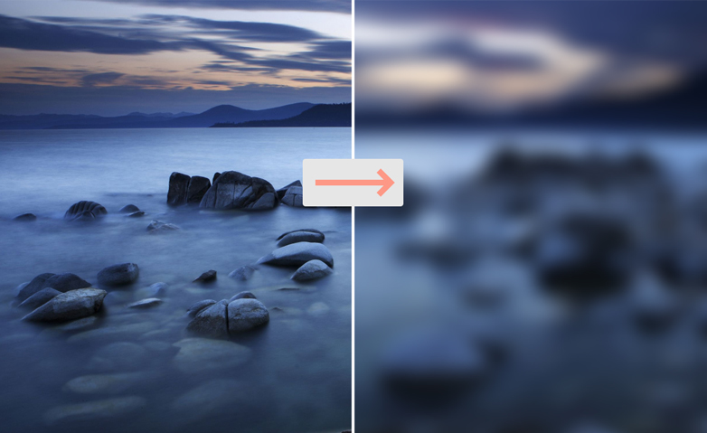

# Parallelizing the Gaussian Blur with OpenMP & CUDA

+ Multicore Programming course project from Ferdowsi University of Mashhad, Winter & Spring 2021.

## Abstract

This repository presents an implementation of Gaussian Blur(an image processing filter) written in C++ that has been parallelized with OpenMP(on CPU) and CUDA(on GPU). 

We take some standard RGB images (in Image Processing literature) e.g. Lena, Barbara and so on. Then we apply gaussian filter on the image, and save the output image.

We try the above method in 3 ways:
1. Serial implementation 
2. Parallel implementation with OpenMP(on CPU)
3. Parallel implementation with CUDA(on GPU)

## Gaussian Blur overview
+ Input: a color or gray-scale image
+ Output: Blurred or smoothed of the input image

In image processing, a Gaussian Blur is the result of blurring an image by a Gaussian function:

$$f(x) = a . exp(- \frac{(x-b)^2}{2c^2} )$$

where a,b and c(non-zero) are real constants. The graph of a Gaussian is a characteristic symmetric "bell curve" shape. The parameter a is the height of the curve's peak, b is the position of the center of the peak and c (the standard deviation, sometimes called the Gaussian RMS width) controls the width of the "bell".

Mathematically, applying a Gaussian blur to an image is the same as convolving the image with a Gaussian function.

Gaussian Blur is widely used effect in reducing image noise and detail. Gaussian Blur is also used as a pre-processing stage in computer vision algorithms in order to enhance image structures at different scales.

You can see the effect of the Gaussian Blur on an image as shown below:

## Serial implementation

## Parallel implementation with OpenMP

## Parallel implementation with CUDA

## Conclusion

## References
1. https://en.wikipedia.org/wiki/Gaussian_function
2. https://en.wikipedia.org/wiki/Gaussian_blur